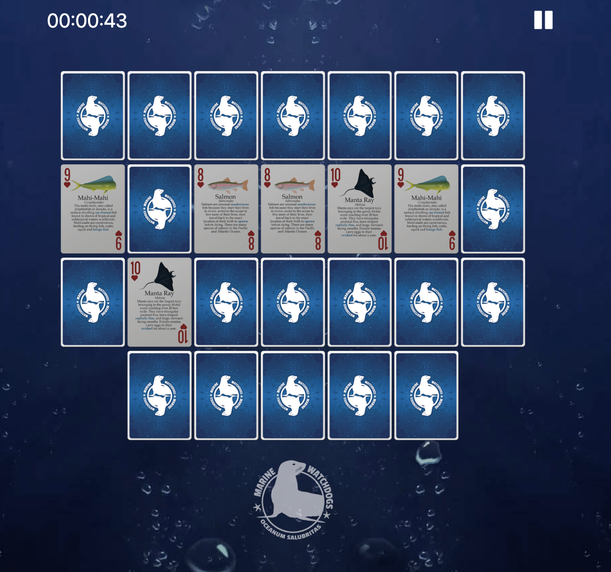

# marine-match-game

## Description

This simple card matching game was built to help promote Marine Watchdog's platform and showcase the cool playing card decks the organization has for sale.

## Installation

As of now, the card game has not been incorporated onto the main Marine Watchdogs website, so to install the game, you have to download the repo files and open the index.html file in your browser to play the game.

## Usage

The game opens on an modal asking whether you would like to start the game. To play the game, you unflip two cards at a time with the goal of making a pair. When you get a pair, the cards remain face up. Once you have found all the pairs, the game is done and you can view your time.

## Credits

Marine Watchdogs: https://marinewatchdogs.org/
Boostrap 5: https://getbootstrap.com/
EasyTimer: https://albert-gonzalez.github.io/easytimer.js/
jquery: https://jquery.com/

## License

GNU GENERAL PUBLIC LICENSE